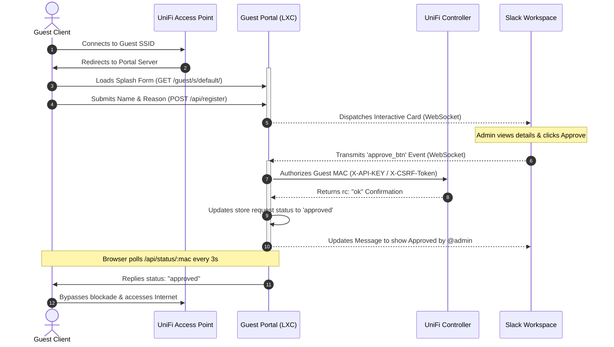

# unifi-guest-portal

An on-premises, production-grade External Captive Portal for Ubiquiti UniFi Controllers integrated with Slack Socket Mode. When a guest requests Wi-Fi access, an interactive Slack notification is sent to administrators for instant, one-click approval or rejection.

---

## 🏗️ Architecture Overview

The application is structured into four main isolated, light-weight software components running inside a single Node.js process:

```
                                  +------------------------------------+
                                  |         unifi-guest-portal         |
                                  |                                    |
  [ Guest Client ]                |  +------------------------------+  |               [ Slack Workspace ]
         |                        |  |     Captive Portal Engine    |  |                        |
         +---(Redirection/Form)----->|  (Express Web/Polling Server)|<---(Bidirectional WebSocket)+
         |                        |  +--------------+---------------+  |                        |
         |                        |                 |                  |                        |
         |                        |                 v                  |                        |
         |                        |  +--------------+---------------+  |                        |
         |                        |  |       Session Database       |  |                        |
         |                        |  |       (In-Memory Store)      |  |                        |
         |                        |  +--------------+---------------+  |                        |
         |                        |                 |                  |                        |
         |                        |                 v                  |                        |
         |                        |  +--------------+---------------+  |                        |
         |                        |  |       UniFi Provisioner      |  |                        |
         |                        |  |     (Controller Client)      |  |                        |
         |                        |  +--------------+---------------+  |                        |
         |                        +-----------------|------------------+                        |
         |                                          |                                           |
         v                                          v                                           v
[ UniFi Access Point ]<--------------------[ UniFi Controller ]-------------------------[ Admin Approval ]
```

1.  **Captive Portal Engine (Express Web Server):** Renders the secure HTML splash page, registers guest metadata, and exposes a high-frequency (3s) status polling API for guest browsers.
2.  **Slack Broker (Bolt SDK Socket Mode Client):** Establishes and maintains a persistent, secure outbound WebSocket connection to Slack's servers. Receives admin button clicks and updates Slack cards in place.
3.  **UniFi Provisioner (API Client):** Dispatches guest authentication instructions directly to your local controller. Operates dynamically over Local API Keys or Local-Admin cookie sessions (with CSRF protection).
4.  **Session Database (In-Memory Key-Value Store):** Manages current active registration sessions. Runs a light-weight background routine (TTL) to prevent memory leaks by evicting stale or expired records.

---

## 🔄 Connection & Approval Flow



---

## 🚀 Key Features

*   **Responsive Captive Portal Page:** Modern CSS-styled mobile-friendly interface for guest sign-ins.
*   **Slack Socket Mode (No Public Ports Needed):** Maintains a secure, outbound persistent WebSocket connection to Slack, eliminating the need to expose your network to inbound public ports.
*   **One-Click Interactive Approvals:** Admins approve or deny access requests directly inside Slack using Block Kit buttons.
*   **UniFi OS API Integration:** Supports both standard **Local User logins** (with automatic CSRF protection) and modern **Local API Keys** (with automatic fallback).
*   **Defensive Security:** Full sanitization against Reflected XSS (cross-site scripting) on query parameters and sanitization against formatting/mention injection in Slack inputs.
*   **Professional Logging & Timing Diagnostics:** Detailed sub-millisecond structured logs (Winston) measuring DNS, SSL handshakes, and controller API roundtrips.
*   **Local State Management:** In-memory request cache featuring an automatic TTL cleanup routine (pending requests expire after 1 hour; processed requests expire after 24 hours).
*   **Debian Packaging & Actions CI:** GitHub Actions compiles the app using `esbuild` into a self-contained Single-File bundle with zero host dependencies, wrapped inside an Ubuntu/Debian `.deb` package using systemd daemonization.

---

## 🛠️ Installation (On Ubuntu/Debian LXC Container)

1.  **Download the latest package** from your repository's [Releases](https://github.com/spoutin/unifi-guest-portal/releases) tab.
2.  **Install the package:**
    ```bash
    sudo dpkg -i unifi-guest-portal_1.0.0_all.deb
    ```
    *This creates a system user `unifi-portal`, registers the service in systemd, and creates the configuration folder structure.*
3.  **Edit your configuration:**
    ```bash
    sudo nano /etc/unifi-guest-portal/config.env
    ```
4.  **Restart the service:**
    ```bash
    sudo systemctl restart unifi-guest-portal
    ```

---

## ⚙️ Configuration (`/etc/unifi-guest-portal/config.env`)

| Variable | Description | Example |
|---|---|---|
| `PORTAL_PORT` | Listening port for the portal web server (Default: `3000`) | `3000` |
| `PORTAL_HOST` | Local binding interface (Set to `127.0.0.1` behind reverse proxies) | `0.0.0.0` |
| `SLACK_BOT_TOKEN` | Slack Bot User OAuth Token | `xoxb-abc123xyz` |
| `SLACK_APP_TOKEN` | Slack App-Level Token (for Socket Mode) | `xapp-1-abc123xyz` |
| `SLACK_CHANNEL_ID` | Slack Channel ID where approval notifications are sent | `C06A1B2C3D4` |
| `UNIFI_CONTROLLER_URL`| URL of your UniFi OS controller | `https://10.0.0.11` |
| `UNIFI_SITE` | Site ID in your controller (usually `default`) | `default` |
| `UNIFI_API_KEY` | *(Recommended)* UniFi OS Local API Key (bypasses cookie login) | `your_local_api_key` |
| `UNIFI_USERNAME` | Local Admin Username (if not using API Key) | `api-portal` |
| `UNIFI_PASSWORD` | Local Admin Password (if not using API Key) | `your_secret_password` |
| `GUEST_AUTH_DURATION` | WiFi authorization duration in minutes (e.g., `2880` = 48h) | `2880` |
| `LOG_LEVEL` | Level of logs output (`info` or detailed `debug` timing metrics) | `info` |

---

## 🔒 UniFi Controller Configuration

To route clients through your new portal, apply these settings in your **UniFi Controller (Cloud Key / UDM)**:

1.  **Enable the Hotspot Portal:**
    *   Go to **Settings > Hotspot Portal**.
    *   Set **Authentication** to **External Portal Server**.
    *   Set **IP Address** to your LXC container's public IP.
    *   Set redirection to port `3000` (e.g. `http://<LXC-IP>:3000/guest/s/default/`).
2.  **Allow Pre-Authorization Access (Crucial):**
    *   Under Hotspot Portal settings, locate **Access Control > Pre-Authorization Access**.
    *   Add your LXC container IP as an allowed subnet: `<Your-LXC-IP>/32`.
    *   *This allows unauthorized guests to connect and load the login page.*
3.  **Apply to Guest Wi-Fi:**
    *   Go to **Settings > WiFi** and select your Guest SSID.
    *   Change the **Security / Network Type** to **Hotspot Portal** (or check *Guest Portal*).

---

## 🌐 Behind a Reverse Proxy (Optional - Caddy)

To protect traffic and enable HTTPS without exposing public ports, you can compile Caddy with the **Cloudflare DNS plugin** using `xcaddy` to perform DNS-01 Let's Encrypt challenges.

### 1. Build Caddy
```bash
sudo apt install xcaddy -y
xcaddy build --with github.com/caddy-dns/cloudflare
sudo mv caddy /usr/bin/caddy
```

### 2. Configure Caddyfile (`/etc/caddy/Caddyfile`)
```caddyfile
wifi.yourdomain.com {
    reverse_proxy 127.0.0.1:3000
    tls {
        dns cloudflare {env.CLOUDFLARE_API_TOKEN}
    }
}
```

---

## 💻 Developer Setup

If you want to run the project locally or contribute:

```bash
# Install dependencies
npm install

# Run the test suite
npm test

# Compile single-file JS bundle using esbuild
npm run build

# Start the portal in development mode
npm start
```
